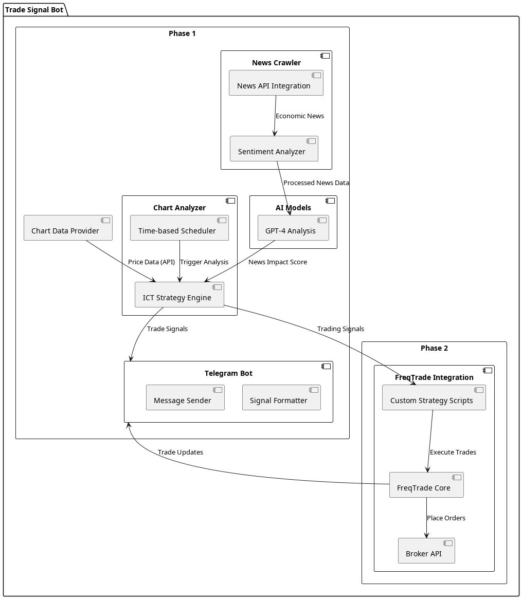

# Product Requirement Document (PRD)

## 1. Overview

### 1.1 Product Name
📈 AI-Powered Trading Bot

### 1.2 Purpose
The purpose of this application is to provide trading signals for the XAU/USD pair by analyzing forex news and technical chart data. Initially, the bot will return the data for manual execution, and later it will automatically execute trades.

### 1.3 Scope
- Phase 1: Data collection, processing, and manual signal notification.
- Phase 2: Automated trade execution.

## 2. Features

### 2.1 Data Collection
- **📰 Forex News Scraper**: Crawl news from forex news portals.
  - **Functional Requirement**: The scraper should fetch news articles every hour.
  - **Non-Functional Requirement**: The scraper should handle up to 1000 articles per hour without performance degradation.
- **📊 Technical Chart Data Fetcher**: Gather technical chart data using APIs.
  - **Functional Requirement**: Fetch data for XAU/USD pair every 5 minutes.
  - **Non-Functional Requirement**: Ensure data fetch operations complete within 2 seconds.

### 2.2 Data Processing
- **🧹 Data Cleaning**: Clean and preprocess the collected data.
  - **Functional Requirement**: Remove duplicates and irrelevant data points.
  - **Non-Functional Requirement**: Data cleaning should maintain data integrity and consistency.
- **🔍 Feature Extraction**: Extract relevant features for decision making.
  - **Functional Requirement**: Extract features such as sentiment scores from news and technical indicators from chart data.
  - **Non-Functional Requirement**: Feature extraction should be completed within 1 minute for each data batch.

### 2.3 Model Training
- **🤖 GPT-4 Model**: Use GPT-4 to analyze textual data and generate insights for trading signals.
  - **Functional Requirement**: Train the model with historical data and update it weekly.
  - **Non-Functional Requirement**: Ensure model training completes within 6 hours.

### 2.4 Decision Making
- **📈 Signal Generation**: Use the insights from GPT-4 and technical indicators to generate buy/sell signals.
  - **Functional Requirement**: Generate signals with at least 70% accuracy.
  - **Non-Functional Requirement**: Signal generation should not exceed 5 seconds per request.
- **📊 ICT Strategy Implementation**: Incorporate ICT concepts such as market structure, liquidity pools, order blocks, and fair value gaps to enhance decision making.
  - **Functional Requirement**: Implement ICT strategy rules in the decision-making process.
  - **Non-Functional Requirement**: Ensure ICT strategy processing completes within 3 seconds.

### 2.5 Notification System
- **📲 Telegram Bot**: Send trading signals via Telegram for manual execution.
  - **Functional Requirement**: Send notifications within 1 second of signal generation.
  - **Non-Functional Requirement**: Ensure the bot can handle up to 1000 users concurrently.

### 2.6 Automated Execution (Phase 2)
- **🔗 Trading Platform Integration**: Integrate with a trading platform API to execute trades automatically.
  - **Functional Requirement**: Execute trades within 1 second of signal generation.
  - **Non-Functional Requirement**: Ensure secure and reliable API communication.

## 3. Technical Requirements

### 3.1 Programming Languages
- 🐍 Python

### 3.2 Libraries and Tools
- `openai` for interacting with GPT-4
- `requests` for HTTP requests
- `BeautifulSoup` for web scraping
- `pandas` for data processing
- `python-telegram-bot` for Telegram notifications

### 3.3 APIs
- Forex news portal API (if available)
- Alpha Vantage or Yahoo Finance for technical chart data

## 4. User Stories

### 4.1 As a User
- I want to receive trading signals for XAU/USD via Telegram so that I can manually execute trades.
  - **Acceptance Criteria**: Receive accurate and timely trading signals via Telegram.
- I want the bot to analyze both news and technical data to provide accurate signals.
  - **Acceptance Criteria**: Signals should be based on both news sentiment and technical indicators.

### 4.2 As a Developer
- I want to easily configure the bot with API keys and other settings.
  - **Acceptance Criteria**: Configuration should be straightforward and well-documented.
- I want to ensure the bot can be extended to support additional currency pairs and automated execution.
  - **Acceptance Criteria**: The codebase should be modular and extensible.

## 5. Milestones

### 5.1 Phase 1
- **🛠️ Milestone 1**: Implement forex news scraper.
- **🛠️ Milestone 2**: Implement technical chart data fetcher.
- **🛠️ Milestone 3**: Develop data processing pipeline.
- **🛠️ Milestone 4**: Use GPT-4 for textual data analysis and signal generation.
- **🛠️ Milestone 5**: Integrate Telegram bot for notifications.

### 5.2 Phase 2
- **🛠️ Milestone 6**: Integrate with trading platform API for automated execution.

## 6. Risks and Mitigations

### 6.1 Data Quality
- **⚠️ Risk**: Inaccurate or incomplete data may lead to poor signal quality.
- **🛡️ Mitigation**: Implement robust data cleaning and validation processes.

### 6.2 Model Accuracy
- **⚠️ Risk**: The AI model may not provide accurate signals.
- **🛡️ Mitigation**: Continuously retrain the model with new data and improve feature extraction techniques.

### 6.3 API Limitations
- **⚠️ Risk**: API rate limits or changes may affect data collection.
- **🛡️ Mitigation**: Implement error handling and fallback mechanisms.

## 7. Glossary

- **XAU/USD**: The currency pair representing the value of gold (XAU) in US dollars (USD).
- **GPT-4 Model**: A large language model used to analyze textual data and generate insights.
- **Telegram Bot**: A bot that sends messages via the Telegram messaging platform.
- **ICT Strategy**: Inner Circle Trading strategy that focuses on market structure, liquidity pools, order blocks, and fair value gaps.

## 8. Architecture Design

The system architecture comprises three main components:
1. **Chart Analyzer**: Implements ICT strategy to identify trading signals.
2. **News Crawler**: Gathers and processes fundamental news data.
3. **Telegram Bot**: Sends trade signals and rationale to the user.

### System Architecture Diagram

### ICT Strategy Engine Flow

### ICT Strategy Engine Implementation

The ICT Strategy Engine will identify trade setups using the following steps:

1. **Market Structure Analysis**
   - Detect higher highs (HH), lower lows (LL), and consolidation zones
   - Algorithm: Sliding window approach for trend formation analysis
   
2. **Liquidity Zone Identification**
   - Find price levels with stop-loss clusters
   - Algorithm: Analyze recent highs/lows with volume data overlay

3. **Fair Value Gap (FVG) Detection**
   - Identify buying/selling pressure imbalances
   - Algorithm: Pattern recognition for wicks and gaps

4. **Time-Based Filtering**
   - Session-based analysis (London/NY)
   - Implementation: Python schedule library

### News Crawler Design

1. **Source Integration**
   - NewsAPI/ForexFactory RSS integration
   - Implementation: requests + BeautifulSoup

2. **Sentiment Scoring**
   - Keyword analysis: "hawkish," "dovish"
   - Implementation: TextBlob/NLTK

3. **Output Format**
   - Numerical volatility score
   - Impact level classification

### Telegram Bot Implementation

1. **Signal Formatter**
   - Market condition summary
   - Entry/SL/TP details
   - News impact assessment

2. **Message Format**

🔔 *Trade Signal - XAU/USD* 🔔  
- Entry: 1925.30  
- SL: 1918.00  
- TP: 1940.50  
- Rationale: Liquidity grab above resistance, bullish order block confirmed.  
- News Impact: Medium (FOMC Minutes scheduled in 2 hours).  

## 9. Implementation Steps

### 9.1 Infrastructure Setup
- Install required libraries:
  - schedule
  - python-telegram-bot
  - requests
  - TextBlob
- Configure API connections:
  - MetaTrader/TradingView for chart data
  - NewsAPI/ForexFactory for news
  - Telegram Bot API

### 9.2 Core Module Development
1. **ICT Strategy Engine**:
   - Implement market structure analysis
   - Build liquidity zone detection
   - Develop FVG identification
   - Set up time-based filters

2. **News Crawler**:
   - Set up news source integrations
   - Implement sentiment analysis
   - Create impact scoring system

3. **Telegram Bot**:
   - Design message templates
   - Implement signal formatting
   - Set up real-time notifications

### 9.3 Testing Protocol
1. **Algorithm Validation**:
   - Backtest ICT strategy components
   - Validate news sentiment accuracy
   - Test signal generation timing

2. **Performance Testing**:
   - Measure API response times
   - Verify concurrent user handling
   - Test error handling scenarios

### 9.4 Deployment
1. **Environment Setup**:
   - Configure cloud/server infrastructure
   - Set up monitoring tools
   - Implement logging system

2. **Production Release**:
   - Deploy core modules
   - Enable monitoring
   - Begin user acceptance testing

## 10. Quality Metrics

### 10.1 Signal Quality
- Technical Analysis Accuracy: >70%
- News Sentiment Correlation: >65%
- Signal Timing Precision: <2 seconds

### 10.2 System Performance
- API Response Time: <500ms
- News Processing Delay: <1 minute
- Notification Delivery: <1 second

### 10.3 Reliability
- System Uptime: >99.9%
- Error Recovery: <5 minutes
- Data Consistency: >99.99%

## 11. Success Criteria

1. **Technical Excellence**
   - Accurate market structure identification
   - Reliable liquidity zone detection
   - Precise FVG recognition

2. **User Experience**
   - Clear signal presentation
   - Timely notifications
   - Actionable trade information

3. **System Performance**
   - Minimal latency
   - High availability
   - Robust error handling

## 12. Monitoring and Evaluation

### 12.1 Performance Tracking
- Track signal success rate
- Monitor system response times
- Measure user engagement

### 12.2 Feedback Collection
- Regular user surveys
- Performance analytics
- System health metrics

### 12.3 Continuous Improvement
- Weekly performance reviews
- Strategy refinement
- System optimization

## 13. Future Enhancements

### 13.1 Phase 2 Features
- Multi-pair trading support
- Advanced backtesting tools
- Custom strategy builder

### 13.2 Technical Improvements
- Machine learning integration
- Real-time market correlation
- Advanced risk management

### 13.3 User Experience
- Mobile application
- Custom alert settings
- Performance analytics dashboard